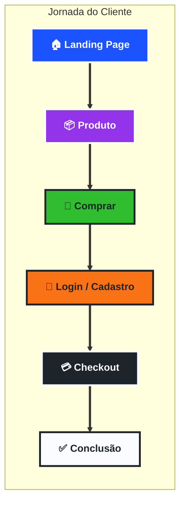

# Interface
### *Sua voz, seu sopro.*

---

## 📽️ A jornada do usuário
*A experiência de quem utiliza o SOPRO, do primeiro contato à comunicação real.*

  
Jornada do usuário

    

##  Ecossistema de interação
*Onde a tecnologia encontra a humanidade.*

<table align="center" style="border: none;">
  <tr>
    <td align="center" width="45%" style="vertical-align: top;">
      <h3>🤖 Chatbot de suporte</h3>
      
Auxílio imediato para familiares e cuidadores configurarem o dispositivo.

       
      
        
      
  </td>
    <td align="center" width="45%" style="vertical-align: top;">
      <h3>♿ Ferramenta de acessibilidade</h3>
      
Ajustes dinâmicos de contraste, voz e tamanho para diferentes necessidades.Ferramenta feita especialmente por nós

       
      
        
     
  </td>
  </tr>
</table>

---
---

##  Design System & UI
*Focado em simplicidade cognitiva e alta legibilidade.*

### 1. Interface adaptativa 
Nossa interface foi construída para ser leve. O frontend consome os dados do **Edge AI** em tempo real, garantindo que o feedback visual do sopro seja instantâneo.

### 2. Acessibilidade 
 **Contraste Elevado:** Seguindo diretrizes WCAG para usuários com baixa visão.
 **Navegação Simplificada:** Menos cliques, mais ação.
 **Feedback Sonoro:** Confirmação visual e auditiva de cada comando enviado pelo hardware.

---

## 💻 Stack de Frontend

  
  
  

---

---

<b>SOPRO Equipe 1</b> • Licença MIT • 2026

